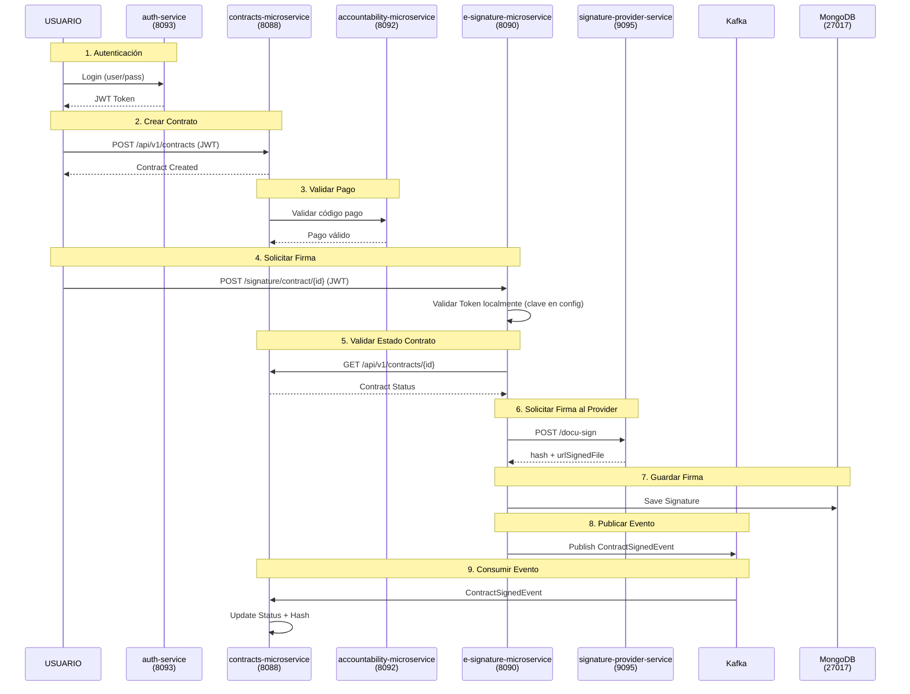
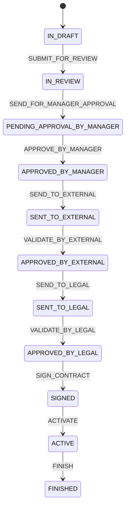

# Proyecto de MICROSERVICIOS MITOCODE

## Descripción

El proyecto es una arquitectura de microservicios Spring Boot (Java 21) para la gestión de contratos y firmas electrónicas.

## Puertos de Servicios

Al arrancar todas las apps, usar el perfil dev

| Servicio | Puerto |
|----------|--------|
| contracts-microservice | 8088 |
| e-signature-microservice | 8090 |
| signature-provider-service | 9095 |
| accountability-microservice | 8092 |
| auth-service | 8093 |
| discovery-server (Eureka) | 8761 |
| config-server | 8888 |

## Infraestructura (Docker)

| Componente | Puerto |
|------------|--------|
| PostgreSQL (contracts) | 5433 |
| PostgreSQL (auth) | 5435 |
| PostgreSQL (accountability) | 5432 |
| MongoDB | 27017 |
| Kafka | 9092 |
| Kafka UI | 6048 |
| OTEL Collector | 4317, 4318 |

## Arquitectura de Flujo



## Microservicios

### contracts-microservice (8088)
- CRUD de contratos
- Gestión de estados (State Machine)
- Historial de aprobaciones
- Consumer de eventos de firma (Kafka)
- Integración con accountability para pagos

### e-signature-microservice (8090)
- Orquestador de firma (Saga Pattern)
- Valida estado del contrato
- Llama a signature-provider-service
- Persiste firmas en MongoDB
- Publica eventos de firma a Kafka

### signature-provider-service (9095)
- Simula proveedor de firma electrónica
- Genera hash de documento
- Genera URL de documento firmado
- **NO registrado en Eureka ni usa Kafka**

### accountability-microservice (8092)
- Gestión de pagos
- Validación de códigos de pago
- Integración con contracts

### auth-service (8093)
- Autenticación y autorización JWT
- Gestión de usuarios y roles
- **OpenAPI/Swagger** disponible (único microservicio con documentación API)

## Estados de Contrato



## Tecnologías

| Categoría | Tecnología |
|-----------|------------|
| Framework | Spring Boot 4.0.3 |
| Lenguaje | Java 21 |
| Mensajeria | Apache Kafka |
| Base de Datos | PostgreSQL, MongoDB |
| Registry | Netflix Eureka |
| Config | Spring Cloud Config |
| Resilience | Resilience4j (Circuit Breaker, Retry) |
| Seguridad | JWT, OAuth2 Resource Server |
| Observabilidad | OpenTelemetry |

## Ejemplo: Crear Contrato

```bash
curl -X POST "http://localhost:8088/api/v1/contracts" \
  -H "Authorization: Bearer <JWT_TOKEN>" \
  -H "Content-Type: application/json" \
  -d '{
    "name": "Contrato de Servicio TI",
    "description": "Soporte y mantenimiento",
    "type": "CONTRACT",
    "serviceType": "SERVICE",
    "startDate": "2026-03-10",
    "endDate": "2026-12-31",
    "thirdPartyId": "uuid-tercero",
    "createdBy": "uuid-usuario",
    "requestedArea": "uuid-area",
    "requestedCompany": "uuid-empresa",
    "amount": 15000.50,
    "urlFile": "http://ejemplo.com/contrato.pdf"
  }'
```

## Ejemplo: Firmar Contrato

```bash
curl -X POST "http://localhost:8090/signature/contract/{contractId}" \
  -H "Authorization: Bearer <JWT_TOKEN>" \
  -H "Content-Type: application/json" \
  -d '{
    "urlDocument": "https://storage/contrato.pdf",
    "email": "notificaciones@empresa.com",
    "signerName": "Juan",
    "signerLastName": "Perez",
    "signerDni": "12345678",
    "signerPhone": "999888777",
    "signerEmail": "juan.perez@correo.com"
  }'
```

## Ejemplo: Login

```bash
curl -X POST "http://localhost:8093/api/v1/auth/login" \
  -H "Content-Type: application/json" \
  -d '{
    "username": "usuario",
    "password": "contraseña"
  }'
```

---

## Checklist de Entrega

### Requisitos Generales

- [x] **Caso de negocio**: Proceso de firma de contratos con múltiples pasos
- [x] **SAGA**: Orquestación en e-signature-microservice (4 pasos: Validar → Firmar → Publicar → Persistir)
- [x] **Compensaciones**: Cada paso del SAGA tiene método `compensate()` para revertir
- [x] **RestClient**: Comunicación HTTP entre servicios via `RestClient`
- [x] **@CircuitBreaker**: Implementado en `SignatureProviderClient` y `AccountabilityPortAdapter`
- [x] **@Retry**: Implementado en `SignatureProviderClient` y `AccountabilityPortAdapter`
- [x] **Eureka**: `discovery-server` + clientes en cada microservicio
- [x] **Config Server**: config-server disponible en puerto 8888
- [x] **Bases de datos independientes**:
  - contracts-microservice → PostgreSQL (5433)
  - auth-service → PostgreSQL (5435)
  - accountability-microservice → PostgreSQL (5432)
  - e-signature-microservice → MongoDB (27017)
- [x] **Kafka Producer**: e-signature-microservice publica eventos
- [x] **Kafka Consumer**: contracts-microservice consume eventos

### Seguridad

- [x] **JWT**: auth-service genera tokens JWT
- [x] **Validación de token**: Cada microservicio valida JWT localmente (clave en config)
- [x] **@PreAuthorize**: Implementado en endpoints de contratos y firma

### Documentación y Observabilidad

- [x] **Swagger**: auth-service documentado con OpenAPI
- [ ] **API Gateway**: No implementado (opcional)
- [ ] **Grafana/Prometheus**: No implementado (opcional)

### Infraestructura

- [x] **docker-compose.yml**: PostgreSQL, MongoDB, Kafka, Kafka UI, OTEL Collector
- [x] **Ejecución**: `docker compose up -d` levanta toda la infraestructura

### Documentación

- [x] **README.md**: Este archivo con flujo de negocio y arquitectura
