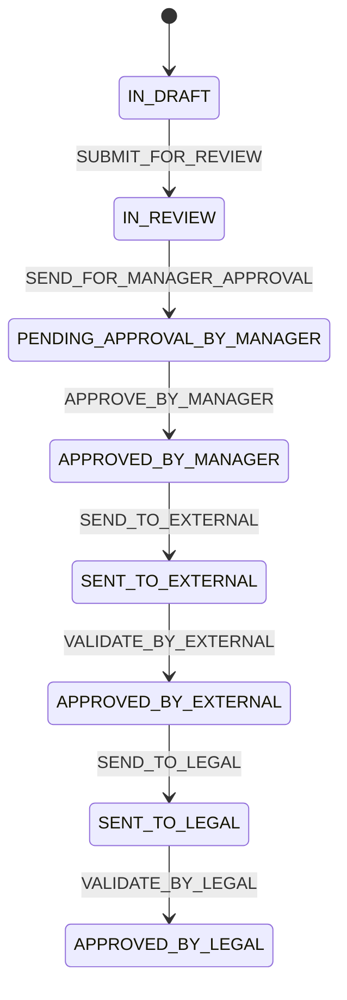

# contracts-microservice

Microservicio de gestion del ciclo de vida de contratos en Spring Boot (Java 21).

## Que hace este microservicio

- Registra contratos con datos base (tipo, fechas, monto, tercero, area y compania solicitante).
- Consulta contratos por `contractId`.
- Orquesta el flujo de aprobaciones y validaciones por estados del contrato.
- Persiste el historial de aprobaciones (manager, externo, legal) asociado al contrato.

Base URL de ejemplo:

- `http://localhost:8088/api/v1/contracts`

## Endpoints principales

- `POST /api/v1/contracts` -> crea un contrato.
- `GET /api/v1/contracts/{contractId}` -> obtiene el detalle de un contrato.
- `PATCH /api/v1/contracts/{contractId}/status` -> aplica una accion de transicion de estado.

## Flujo de estados (Mermaid)



## Ejemplo: crear contrato

`POST http://localhost:8088/api/v1/contracts`

### Request

```json
{
  "name": "Contrato de Servicio TI 2027",
  "description": "Soporte y mantenimiento de plataforma",
  "type": "CONTRACT",
  "serviceType": "SERVICE",
  "startDate": "2026-03-10",
  "endDate": "2026-12-31",
  "thirdPartyId": "22222222-2222-2222-2222-111111111111",
  "createdBy": "33333333-3333-3333-3333-333333333333",
  "requestedArea": "44444444-4444-4444-4444-444444444444",
  "requestedCompany": "55555555-5555-5555-5555-555555555555",
  "amount": 15000.50,
  "urlFile": "http://examples.com/pdf/12344"
}
```

## Ejemplo: obtener contrato por ID

`GET http://localhost:8088/api/v1/contracts/58f1ed0b-c443-4ebe-a153-2f73552a2f5c`

### Response

```json
{
  "contractId": "58f1ed0b-c443-4ebe-a153-2f73552a2f5c",
  "name": "Contrato de Servicio TI 2029",
  "description": "Soporte y mantenimiento de plataforma",
  "type": "CONTRACT",
  "serviceType": "SERVICE",
  "relatedContractId": null,
  "startDate": "2026-03-10",
  "endDate": "2026-12-31",
  "thirdPartyId": "22222222-2222-2222-2222-222222222222",
  "createdBy": "33333333-3333-3333-3333-333333333333",
  "createdAt": "2026-03-24",
  "requestedArea": "44444444-4444-4444-4444-444444444444",
  "requestedCompany": "55555555-5555-5555-5555-555555555555",
  "amount": 15000.5000,
  "urlFile": "http://examples.com/pdf/12344",
  "hashSignature": null,
  "urlSignedFile": null,
  "status": "IN_DRAFT",
  "approvals": []
}
```

## Ejemplos de transicion de estado por etapas

Endpoint comun para todas las etapas:

`PATCH http://localhost:8088/api/v1/contracts/58f1ed0b-c443-4ebe-a153-2f73552a2f5c/status`

### Etapa 1

```json
{
  "action": "SUBMIT_FOR_REVIEW"
}
```

### Etapa 2

```json
{
  "action": "SEND_FOR_MANAGER_APPROVAL"
}
```

### Etapa 3

```json
{
  "action": "APPROVE_BY_MANAGER",
  "managerId": "8e8be425-929e-4477-8099-eb2307200833",
  "approverId": "03a8cfc7-3795-4447-af60-e661cb9cc0d1",
  "approverEmail": "test@gmail.com",
  "approverName": "TEST USER",
  "comment": "VB BY MANAGER"
}
```

### Etapa 4

```json
{
  "action": "SEND_TO_EXTERNAL"
}
```

### Etapa 5

```json
{
  "action": "VALIDATE_BY_EXTERNAL",
  "managerId": "8e8be425-929e-4477-8099-eb2307200833",
  "approverId": "03a8cfc7-3795-4447-af60-e661cb9cc0d1",
  "approverEmail": "test1@gmail.com",
  "approverName": "TEST EXTERNAL",
  "comment": "VB BY EXTERNAL"
}
```

### Etapa 6

```json
{
  "action": "SEND_TO_LEGAL"
}
```

### Etapa 7

```json
{
  "action": "VALIDATE_BY_LEGAL",
  "managerId": "8e8be425-929e-4477-8099-eb2307200833",
  "approverId": "03a8cfc7-3795-4447-af60-e661cb9cc0d1",
  "approverEmail": "testlegal@gmail.com",
  "approverName": "TEST legal",
  "comment": "VB BY LEGAL"
}
```

## Nota

En el codigo existen acciones adicionales (`ACTIVATE`, `FINISH`) para el cierre del ciclo de vida completo del contrato. Este documento detalla el flujo solicitado de 7 etapas.
